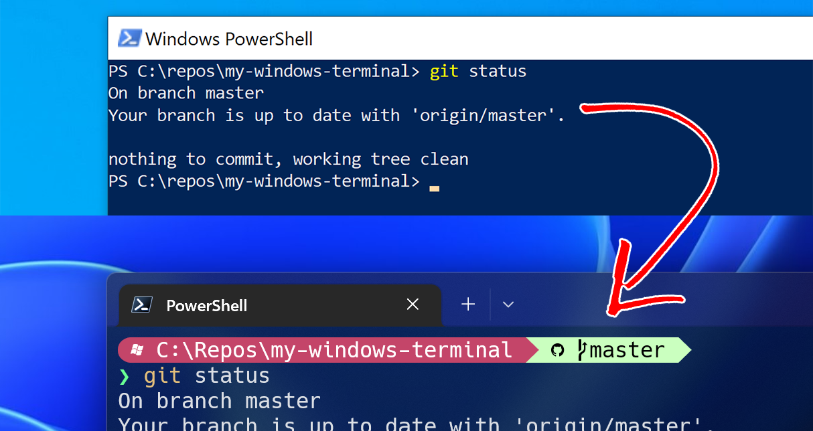

## My Windows Terminal

This repository has two install scripts, i-e `Install_Step1.ps1` and `Install_Step2.ps1`. These scripts will automatically setup everything that needs to be done to get the fancy pants PowerShell Prompt. 
You don't need to run these scripts with elevated privileges (`Run as Administrator`) but before running the script,
you will need to allow execution of scripts by setting the execution policy to `RemoteSigned` with the following command -- and this ONLY works if you run `Windows PowerShell` as an Administrator:

`Set-ExecutionPolicy RemoteSigned`

After running the above command, you should exit `Windows Powershell` which you launched as an administrator and launch a regular `Windows Powershell` session and navigate to the place where you cloned this repository. Execute the `Install_Step.ps1` by simply writing:

`./Install_Step1.ps1` 

in Windows PowerShell.

Once the script executes successfully, you will need to exit `Windows PowerShell` and Launch `Windows Terminal` from Start menu. This will be installed automatically by the first install script so you should be able to see it. When you're inside `Windows Terminal` simply navigate to the clone of this repository again and this time run:

`./Install_Step2.ps1`

And this should set up everything you need for a fancy prompt. Once the script executes successfully, exist `Windows Terminal` one last time and launch it again and *hopefully* you should have a nice brand new prmopt now.
